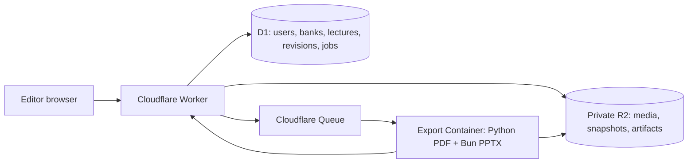

# QUABanks — collaborative question-bank builder

This repository is the extracted and Cloudflare-ready home of the AounMED `pdf_template` editor.
It keeps the validated deterministic PDF/PPTX renderer and adds the Worker/D1/R2/Queue/Container
application boundary for collaborative bank editing. It does not import from, write to, or modify
AounMED's research prototype, Parser Factory, ORES, ROADS, QUIZ, or Tutor implementation.

The local editor remains useful without Cloudflare: it is the deterministic authoring and preview
tool. The Cloudflare Worker is the shared, authenticated application and the only production
persistence boundary.

The visual template is based on `Week 1.pdf`:

- A4 portrait pages with a powder-blue frame.
- A rounded white content card with a dark-navy outline.
- Playful rounded Fredoka cover and section headings.
- Work Sans questions, cases, options, answers, and supporting body copy.
- Two-column MCQ pages with an answer-key pill.
- Single-column SEQ and "Explain why" pages.
- A slate-blue cover with white display lettering and an offset shadow.
- An optional Arabic closing/prayer page matching the source packet's final-page treatment.

## Intended Tutor contract

The Tutor supplies content as `pdf-template-v1` JSON. It does not choose fonts, coordinates,
columns, page breaks, or colors. The renderer validates the JSON and owns the layout
deterministically.

`sample_packet.json` is also the normalization boundary for human-submitted, unorganized question
material. Tutor ingestion and human-input cleanup are intentionally outside this experiment: both
paths must eventually produce the same validated packet before rendering.

```text
Tutor structured JSON
        -> validation
        -> deterministic page and column layout
        -> PDF renderer
        -> manifest and layout-plan checkpoints
        -> rendered PNG review
```

This separation keeps model output reviewable and prevents a malformed response from changing the
visual template.

The editor also performs a conservative recovery for legacy packets: if a question is labeled
`mcq`/`multi_select` but has no usable choices, it is kept with its original stem, answer,
provenance, and a warning, then moved into a single-column **open responses** section. It is never
given fabricated options. The same recovery runs on the server immediately before saving,
rendering, or exporting, which protects PDF/PPTX export from a stale browser session.

## Run the prototype

From this directory:

```bash
uv run python render_template.py sample_packet.json
```

Install the public PPTX dependencies once, then build the editable companion:

```bash
cd editor
bun install
cd ..
bun build_editable_pptx.mjs sample_packet.json
```

The command creates:

```text
output/pdf/week1-template-demo.pdf
output/pptx/week1-template-editable.pptx
output/layout-plan.json
output/manifest.json
```

Render the PDF for visual review with Poppler:

```bash
mkdir -p output/renders
pdftoppm -png -r 144 output/pdf/week1-template-demo.pdf output/renders/page
```

To use different content, copy `sample_packet.json`, keep `schema_version` equal to
`pdf-template-v1`, and change only the document/lecture/section/question data. A document may
contain any number of lectures, and each lecture may contain multiple independently laid-out
sections:

```text
document
└── lectures[]
    └── sections[]
        └── questions[]
```

The JSON schema is available at `schema/pdf-template-v1.schema.json`. Older drafts that put
`document.sections[]` at the top level (with a redundant `section.lecture`) remain accepted by the
Python renderer and are migrated to the nested shape when imported into the editor.

## Supported content in this experiment

- `mcq`: stem, optional case vignette, 2-6 options, and one correct answer.
- `multi_select`: the same option structure with `correct_answers` containing multiple labels.
- `seq`, `ospe`, and `other`: free-response shapes with optional answers and Tutor explanations.
- `explain_why`: prompt plus a blue-gray answer paragraph.
- `lecture_refs`: structured lecture titles and one or more exact slide numbers.
- `bank_source`: the original bank name, question number, and source page numbers.
- `notes`: optional instructional, warning, ordinary, or source-limit notes shown under the question.
- `media`: one or more local images with required alt text and optional captions. Paths must remain
  inside this folder. Legacy `image`/`caption` fields remain accepted for the initial sample format.
- If an imported record is labeled `mcq`/`multi_select` but has fewer than two or more than six
  usable choices, the editor keeps the source text and answer as an open-response `other` question
  with a warning rather than inventing choices. Correct it in the structured editor before export.
- `section.hints`: optional section-specific hints. A hints appendix is inserted immediately after
  that section only when the array is non-empty; no empty appendix page is created.
- Optional `closing_page` with Arabic paragraphs and a signoff. The renderer handles shaping,
  right-to-left display, centering, and pagination; the Tutor supplies only the text.

The cover's visible contents entries are PDF links to the first page of each lecture and each of its
sections. Named destinations and outline/bookmark entries are derived from stable section IDs, so
the JSON does not contain fragile output page numbers.

The fonts are embedded from `assets/fonts/` so the PDF is reproducible and does not depend on a
browser or internet connection. Work Sans, Fredoka, and Noto Sans Arabic are distributed under the
SIL Open Font License; their license texts are stored beside the font files.

Questions are indivisible layout units. If a complete question cannot fit in one column/page at the
minimum type size, rendering stops with a structured error instead of clipping or silently shrinking
the content.

## Question-bank builder editor

`editor/` is a deliberately self-contained Bun webapp for demonstrating the final question-bank
editing step. It is not part of the AounMED Svelte/Rust application and it never talks to the
production database, ORES, ROADS, or QUIZ. The start page lists one editable Example plus local
saved packets. The untouched `sample_packet.json` remains an internal recovery source rather than
a duplicate library card. Browser edits are persisted only in the ignored editor data directory and
are sent to the same deterministic Python renderer used by the command line.

Start it from this repository:

~~~bash
cd /Users/hades/dev/web/QUABanks/editor
bun run dev
~~~

Open <http://localhost:5178>. If that port is occupied, choose another local port without changing
the packet format:

```bash
AOUNMED_PDF_EDITOR_PORT=5179 bun run dev
```

### Start page and local bank library

The URL opens on a bank-library start page rather than dropping directly into the editor. It is the
admin's working shelf:

- **Example** is the preserved editable working copy. On first launch it is captured from the
  existing `editor/data/draft_packet.json` into the ignored `editor/data/example_packet.json`, and
  later Example saves update both files. It may contain the demo OSPE image from
  `assets/sample/neck-ospe-x.png`. Its legacy subject bucket is upgraded so Scalp and face, Neck
  OSPE, and Temporal fossa / infratemporal fossa / TMJ appear as separate lectures.
- The immutable `sample_packet.json` is still the recovery source used by Reset, but it is not shown
  as a second copy of Example.
- **Saved** banks are packets created or imported from the start page. They are stored locally as
  `editor/data/banks/bank-<uuid>.json`. That directory is runtime data and is intentionally ignored
  by git.

The home screen shows each bank's title, week, description, lecture/section/question counts, image
count, and an optional image preview. Use **Create bank** to get a blank packet with one lecture,
one section, and two placeholder choices, or **Import packet** to add an existing
`pdf-template-v1` JSON as a new saved bank. Select **Open editor** to enter the existing three-pane
editor. **← Banks** returns to the shelf; unsaved edits are confirmed before leaving.

The local API behind this screen is intentionally small:

```text
GET  /api/banks              list Example and Saved packets
GET  /api/banks/:id          load one packet and its summary
POST /api/banks              create a blank or imported saved packet
PUT  /api/banks/:id          save a packet (the built-in Example is admin-owned)
```

Saving Example updates its example snapshot and compatibility draft. Saved banks remain separate
files; when Render PDF or Save as PPTX runs, the currently open packet is sent through the existing
compatibility draft only for that preflight. The registry is filesystem-only; no database, provider
call, or AounMED production service is involved.

The three-pane editor is organized as:

- **Lectures**: searchable nested lecture → section → question content tree with question, media,
  and hint counts. Each question row exposes a duplicate action; the same action is also available
  in the structured question editor.
- **Structured editor**: packet metadata, lecture identity/layout, question type, case/station
  text, MCQ choices, answer/explanation, notes, lecture-slide references, bank provenance,
  media paths/alt text/captions, and optional end-of-lecture hints.
- **Live paper**: a paper-style preview of the current question or lecture hint appendix. It is a
  fast editing preview; the Python renderer remains authoritative for pagination and validation.

The workflow is intentionally reversible:

1. Choose a bank on the start page. Edit the loaded normalized packet, or use **Import JSON** inside
   the editor to replace the open packet in memory with another `pdf-template-v1` packet.
2. Use **Save draft** to write the open bank. For Example this is
   `editor/data/draft_packet.json`; for Saved banks it is the matching file under
   `editor/data/banks/`. The source sample remains unchanged.
3. Use **Download JSON** to export the current normalized packet for a Tutor or human workflow.
4. In AounMED Tutor's Quizzes panel, use **Export lecture.json** to download approved, text-only
   quiz content in the `aounmed-lecture-v1` contract. In this editor, **Add lecture.json** appends
   it as one or more new lectures instead of replacing the current draft. Images are deliberately
   omitted for this first export and are marked with a source-limit note so they cannot be mistaken
   for complete visual content.
5. Use **Render PDF** to save the draft and run `render_template.py`. The generated preview is
   `output/pdf/editor-preview.pdf`; layout and manifest checkpoints are isolated under
   `editor/data/render-audit/`.
6. Use **Save as PPTX** to save the same draft through `build_editable_pptx.mjs`. The generated
   editable companion is `output/pptx/editor-preview.pptx` and is downloaded by the browser. The
   server first regenerates the PDF audit/layout plan for the current draft, then passes that fresh
   plan to the PPTX builder; it never reuses a layout plan from a different packet. Run `bun install`
   in `QUABanks/editor` once to install the declared `pptxgenjs` and `jszip` dependencies. No
   private package or external runtime path is required. The PDF preflight uses
   `.venv/bin/python` automatically when it exists; override it with
   `AOUNMED_PDF_EDITOR_PYTHON` or `AOUNMED_PDF_RENDER_PYTHON`.
6. **Reset draft** copies the original sample back into the Example draft file, which is the safe
   recovery path for experiments. Saved banks are not deleted or changed by this action.

The editor intentionally does not perform PDF/OCR extraction in the browser. The real ingestion
pipeline still produces the normalized JSON; this PoC demonstrates how an admin or Tutor output
can be organized, corrected, traced, previewed, and rendered as one question-bank packet.

## Editable design copy

The generated PPTX is the editable companion to the PDF. Its page size is A4 portrait and its text,
panels, section headings, options, notes, answers, and closing copy are native PowerPoint objects;
question images remain replaceable image objects. Open it in PowerPoint, Keynote, or LibreOffice
Impress to correct copy or adjust the design, then export a corrected PDF if needed.

The PPTX embeds the supplied local Work Sans, Fredoka, and Noto Sans Arabic files. The export sets
`embedTrueTypeFonts` and writes the embedded font payloads under `ppt/fonts/`, so the recipient does
not need to install those fonts. A viewer that ignores embedded fonts may still substitute a local
font. The deterministic PDF remains the reproducible publishing artifact; the PPTX is a user-editable
override.

## Production direction

If adopted later, the recommended boundary is:

1. Tutor generates a versioned JSON draft and stores its hash.
2. AounMED validates and checkpoints the normalized draft.
3. The deterministic renderer emits a layout plan and PDF preview.
4. The student/admin approves the preview.
5. Publication stores the JSON, template version, manifest, and final PDF together.

The Tutor should never write directly into ORES or generate arbitrary PDF drawing commands.

## Cloudflare application

The production shape is a small collaborative Worker application. Static editor assets, the API,
authentication, and authorization live in one Worker; durable state is split by responsibility:



The application uses the following boundaries:

| Component | Responsibility | Durable data |
| --- | --- | --- |
| Worker + Static Assets | Serves the editor, validates the shared gate and session cookie, enforces ownership, exposes versioned API routes, and creates export snapshots | None outside bindings |
| D1 | Users, sessions, banks, lectures, sections, questions, revisions, assets, snapshots, and export-job status | SQL rows and optimistic revisions |
| R2 | Private question images, immutable packet snapshots, generated PDFs/PPTXs, and audit manifests | Object keys and bytes |
| Queue | Decouples an export request from rendering | At-least-once delivery; the job row is the idempotency authority |
| Container | Uses a unique temporary directory for each job and runs the existing renderers | Ephemeral scratch space only |

The initial container configuration is one 1-GiB class with a maximum of two instances. Containers
scale to zero, so production requires the Workers Paid plan. The Workers deployment, rather than
a separate Pages project, owns the static assets.

### Repository map

~~~text
QUABanks/
├── src/worker.ts                  Worker API, auth, D1/R2 routes, Queue consumer
├── container/server.ts            Per-export container entry point
├── Dockerfile                     Python + Bun/PptxGenJS renderer image
├── render_template.py             Deterministic PDF renderer
├── build_editable_pptx.mjs        Deterministic editable PPTX builder
├── editor/public/                 Static editor shipped as Worker assets
├── editor/server.ts                Optional standalone local editor server
├── editor/data/                   Local editor drafts; banks/ and audit output are ignored
├── assets/                        Fonts and sample media used by the renderer
├── schema/                         pdf-template-v1 JSON schema
├── sample_packet.json              Built-in admin-owned example seed
├── migrations/                     D1 migrations (never runtime Progress.sql files)
├── wrangler.jsonc                  Worker, D1, R2, Queue, and Container bindings
└── .dev.vars.example               Local-only secret names and safe development defaults
~~~

The source `editor/data/draft_packet.json` and `editor/data/example_packet.json` are intentionally
kept as admin-owned seed material. Runtime saved banks, render audits, exports, Wrangler state,
credentials, and dependencies remain ignored. Do not commit `.dev.vars`, production secrets, or
generated artifacts.

### Authentication and permissions

There are two gates:

1. A visitor enters the shared site-access code. The Worker stores only a signed, expiring access
   cookie; the code itself is a Cloudflare secret.
2. The visitor registers or logs in with a display name and unique PIN. The Worker stores a keyed
   lookup value and a PBKDF2-derived PIN hash, never the raw PIN.

Successful login creates a server-side session row and an HTTP-only, Secure, SameSite session
cookie. Logout revokes the row. Access attempts and PIN attempts are throttled by action and IP.
The local example uses `0000` only as a development admin PIN; choose a different production PIN
and keep it in a Wrangler secret.

All authenticated members can read banks and lectures and can create banks or lectures. A
contributor can edit, reorder, or remove only lectures they own. Bank deletion, global settings,
and edits to another contributor's material are admin-only. A mutation includes the current
entity revision (or `If-Match`); a stale revision returns `409 Conflict` rather than overwriting
newer work. Saves become visible to other users after refresh; this is collaborative persistence,
not same-document CRDT editing.

### D1 data model

The normalized tables are deliberately split so a lecture never has to fit in D1's 2-MB row
limit:

| Table | Important fields | Purpose |
| --- | --- | --- |
| `users` | id, display name, role, PIN lookup/hash, timestamps | Admin and contributors |
| `sessions` | token hash, user, expiry, revoked timestamp | Server-side revocable sessions |
| `access_attempts` | action, IP/key, time bucket, count | Shared-gate and login throttling |
| `banks` | owner, kind, title/week/subtitle/description, revision | Bank identity and bank-level metadata |
| `lectures` | bank, owner, position, metadata, revision, payload | Independently editable lecture packets |
| `sections` / `questions` | parent, position, type, payload | Future fine-grained editing boundary |
| `assets` | owner, R2 key, media type, source metadata | Private uploaded media index |
| `packet_snapshots` | immutable snapshot R2 key, hash, requester | Exact input used for an export |
| `export_jobs` | snapshot, format, status, artifact keys, attempts, error | Queue/container progress and download authority |

Every mutable bank/lecture carries `revision`, `owner_id`, `created_at`, and `updated_at`. D1 is
the authority for metadata and job state; R2 is the authority for large bytes. Historical
snapshots and artifacts are not overwritten by a later edit.

### R2 key layout

R2 is private. The browser gets media and artifacts only through authorized Worker routes:

~~~text
assets/<asset-id>-<safe-name>             uploaded question image
snapshots/<export-job-id>.json             immutable normalized packet
artifacts/<export-job-id>.pdf             deterministic PDF
artifacts/<export-job-id>.pptx            editable PPTX
artifacts/<export-job-id>.audit            renderer/audit manifest
~~~

The container receives a job-local working directory under `/tmp/quabanks-jobs/<job-id>`,
downloads only the snapshot and referenced assets, and never shares a preview path with another
job. A container restart can safely repeat a job because the D1 job id and R2 keys are stable.

### Export lifecycle

Exports are asynchronous even when the UI starts them synchronously:

```mermaid
sequenceDiagram
  participant U as Browser
  participant W as Worker
  participant D as D1/R2
  participant Q as Queue
  participant C as Container
  U->>W: POST /api/exports {bank_id, format}
  W->>D: Validate revision; write immutable snapshot and queued job
  W->>Q: Enqueue job id
  W-->>U: 202 + status URL
  Q->>W: Deliver job (at least once)
  W->>C: POST /jobs with job-local callback token
  C->>C: Download snapshot/assets; render PDF and/or PPTX
  C->>W: PUT artifact and audit manifest
  W->>D: Mark completed or sanitized failed
  U->>W: Poll status; download authorized artifact
```

The queue consumer marks a job running before invoking the container. Artifact writes and status
updates are idempotent. A temporary container failure leaves the job eligible for a later retry;
a malformed packet is recorded as a sanitized failure and is not silently replaced. The Worker
never accepts a client-supplied output path.

## Local development

### Prerequisites

Install or make available:

- Bun (the editor and the Worker package manager/runtime).
- Python 3.11+ and `uv` (the deterministic PDF renderer dependencies).
- Docker Desktop (needed to build/run the Cloudflare Container image).
- Wrangler, installed by the root package.

No Supabase, PostgreSQL, Redis, or OpenAI/OpenCode service is required by QUABanks. The local
Cloudflare Worker uses Wrangler's local D1/R2/Queue simulation; the standalone editor uses local
files only.

### First local start

From `/Users/hades/dev/web/QUABanks`:

~~~bash
bun install
bun install --cwd editor
uv sync
cp .dev.vars.example .dev.vars
# Edit .dev.vars before sharing the machine or using a non-local environment.
bun run db:migrate:local
bun run dev
~~~

Open the URL Wrangler prints (normally `http://localhost:8787`). Enter the local shared code
from `.dev.vars`, then register a local display name and PIN. The first authenticated request
creates the built-in Example bank from `sample_packet.json` if the local database is empty.

For the older renderer-only editor, use a separate terminal:

~~~bash
bun --cwd editor run dev
# Open the port printed by editor/server.ts, normally http://localhost:5178
~~~

The standalone server is useful for deterministic local PDF/PPTX editing and does not provide
Cloudflare authentication or shared persistence. Do not mistake its `editor/data/` files for the
production D1/R2 state.

### Focused checks

~~~bash
bun run typecheck
bun run check:editor
git diff --check
uv run python render_template.py sample_packet.json --output /tmp/quabanks-sample.pdf
~~~

Use the smallest relevant check while editing. Run a full browser/container smoke test only at
the integration boundary; no provider calls are involved in PDF/PPTX rendering.

## Cloudflare provisioning and deployment

The account must be on a Workers Paid plan for Containers. Authenticate Wrangler once:

~~~bash
bunx wrangler login
bunx wrangler whoami
~~~

Create the remote resources once. Names are account-scoped; keep the names aligned with
`wrangler.jsonc`:

~~~bash
bunx wrangler d1 create quabanks
bunx wrangler r2 bucket create quabanks-media
bunx wrangler queues create quabanks-exports
~~~

Copy the D1 `database_id` printed by Wrangler into `wrangler.jsonc`. The production callback is
currently `https://quabanks.onlyghostz.workers.dev`; if the Worker name or workers.dev subdomain
changes, update `INTERNAL_BASE_URL` before starting an export. The container uses it for
authenticated artifact callbacks.

Set production secrets interactively so they never enter Git:

~~~bash
bunx wrangler secret put SITE_ACCESS_CODE
bunx wrangler secret put PIN_LOOKUP_SECRET
bunx wrangler secret put SESSION_SECRET
bunx wrangler secret put EXPORT_INTERNAL_TOKEN
bunx wrangler secret put AOUNMED_ADMIN_PIN
~~~

Use long random values for the lookup/session/internal secrets and a private admin PIN. The
development `.dev.vars` file is not a production secret store.

Apply the migration and deploy the Worker. Wrangler builds the Docker image declared by the
Container configuration as part of deployment:

~~~bash
bun run db:migrate:remote
bun run deploy
QUABANKS_URL=https://quabanks.onlyghostz.workers.dev bun run db:seed:remote
bunx wrangler tail quabanks --format pretty
~~~

If the Worker URL changes, update `INTERNAL_BASE_URL`, deploy again, and verify:

~~~bash
curl -fsS https://<workers-host>/api/health
~~~

The post-deploy smoke test should register two users, verify cross-user reads, edit separate
lectures, create one PDF and one PPTX export, poll both jobs to completion, download both private
artifacts, and verify an admin-only mutation. Do this before deleting the original AounMED
`pdf_template` directory.

### Logs, deployments, and rollback

Useful read-only operational commands:

~~~bash
bunx wrangler tail quabanks --format pretty
bunx wrangler deployments list
bunx wrangler deployments status
~~~

If a deployment is unhealthy, use Wrangler's interactive rollback command and select the last
verified version:

~~~bash
bunx wrangler rollback
~~~

Rollback changes the Worker version; it does not undo D1 migrations or delete R2 objects. Make
database migrations backwards-compatible and keep historical snapshots/artifacts before any
rollback.

## HTTP API

All routes below are under `/api` and require the shared access gate; routes marked authenticated
also require a non-revoked personal session.

| Method | Route | Auth | Purpose |
| --- | --- | --- | --- |
| `POST` | `/access/unlock` | Shared code | Issue a temporary access cookie |
| `GET` | `/session` | Optional | Return access/user state for the UI |
| `POST` | `/auth/register` | Access | Create a contributor/admin bootstrap account |
| `POST` | `/auth/login` | Access | Start a personal session |
| `POST` | `/auth/logout` | Session | Revoke the current session |
| `GET` | `/banks` | Session | List readable banks and summaries |
| `POST` | `/banks` | Session | Create a bank |
| `GET` | `/banks/:id` | Session | Read a bank and its lectures |
| `PUT` | `/banks/:id` | Contributor for their lectures; owner/admin for metadata | Save a bank with expected revision |
| `DELETE` | `/banks/:id` | Admin | Delete a bank and its lectures |
| `GET/POST` | `/banks/:id/lectures` | Session | List or append a lecture (expected bank revision) |
| `GET/PUT/DELETE` | `/banks/:id/lectures/:lectureId` | Owner/admin for mutation | Read, save, or remove one lecture with lecture + bank revisions |
| `POST` | `/assets` | Session | Upload private media to R2 |
| `GET` | `/assets/:key` | Session | Authorized media retrieval |
| `POST` | `/exports` | Session | Snapshot and queue `pdf`, `pptx`, or `both` |
| `GET` | `/exports/:id` | Session | Poll export state and usage/error metadata |
| `GET` | `/artifacts/:id/:format` | Session | Download a completed PDF/PPTX |
| `POST` | `/exports/:id/retry` | Requester/admin | Requeue a failed export |

The internal `/internal/export-input/*` and `/internal/export-output/*` routes are callback
routes for the container and require the separate `EXPORT_INTERNAL_TOKEN`; they are not browser
endpoints.

## Migration checkpoint

This repository is currently at the **copied/scaffolded** stage of the move:

- The validated editor, sample packet, fonts, schema, Python renderer, and Bun PPTX builder are
  present under this target directory.
- The D1 migration, Worker configuration, Dockerfile, and per-job container entry point are
  present as the Cloudflare boundary.
- Remote Cloudflare resource IDs, production secrets, deployment smoke verification, the clean
  QUABanks GitHub commit, and the final AounMED deletion are intentionally still pending.

Do not remove AounMED's original `pdf_template` until the following order is complete:

~~~text
target code and local checks
  -> Cloudflare resources + secrets
  -> remote migration and deployment
  -> deployed auth/edit/export smoke test
  -> clean QUABanks commit pushed to github.com/0xhades/QUABanks
  -> recoverable backup of AounMED/pdf_template
  -> targeted AounMED deletion commit and push
~~~

The original renderer remains deterministic: the Worker supplies explicit packet, asset-root,
output, and audit paths to a unique container job. It must never use a process-global preview
directory or let one user's export read another user's files.

## Official references

- [Cloudflare Containers](https://developers.cloudflare.com/containers/get-started/)
- [Containers pricing](https://developers.cloudflare.com/containers/platform/pricing/)
- [D1 limits](https://developers.cloudflare.com/d1/platform/limits/)
- [R2 object uploads](https://developers.cloudflare.com/r2/objects/upload-objects/)
- [R2 Worker bindings](https://developers.cloudflare.com/r2/api/workers/workers-api-reference/)
- [R2 presigned URLs](https://developers.cloudflare.com/r2/api/s3/presigned-urls/)
- [Cloudflare Queues](https://developers.cloudflare.com/queues/)
- [Wrangler configuration](https://developers.cloudflare.com/workers/wrangler/configuration/)
